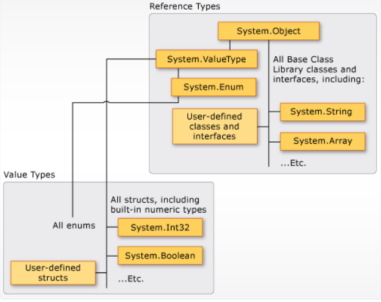

### OOP - Einheitliches Typsystem ###
----
#### Markus Mühleder
---
- Erklären Sie die Bedeutung und den Vorteil eines  'Einheitliches Typsystem'
- -----
Ein einheitliches Typsystem bedeutet, dass alle Typen von einem gemeinsamen Basistyp abgeleitet und daher zu diesem kompatibel sind. In C# heißt dieser gemeinsame Basistyp object (System.Object). Referenztypen sind direkt zu object kompatibel, Werttypen werden durch Boxing zu object kompatibel gemacht. 
Der Nutzen eines einheitlichen Typsystems liegt darin, dass object-Variablen Werte beliebiger Typen referenzieren können. Man kann in ihnen nicht nur Objekte von Klassen speichern, sondern (durch Boxing) auch int-Werte oder char-Werte. Dadurch kann man generische Datenstrukturen implementieren, die mit beliebigen Elementtypen "gefüttert" werden können. 

