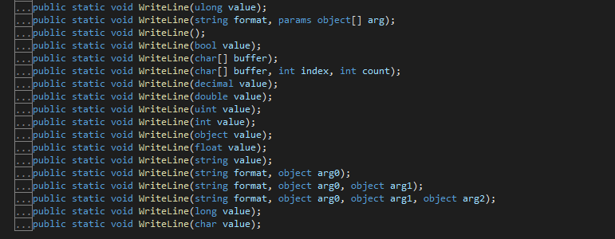
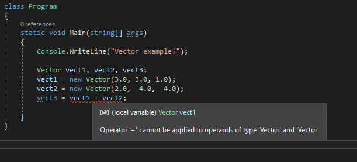
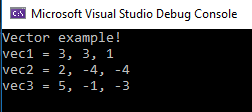
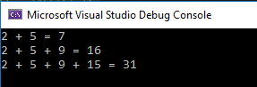

# Konzepte
**Ordner:** Concepts  
**Datei:** OopConcepts.d
## by Martin Pechak
## Erklären Sie die folgenden Begriffe im Zusammenhang (Gegenüberstellung):

- Klasse \<-\> Objekt
- Basisreferenz \<-\> Selbstreferenz
- Konstruktors \<-\> Destruktors
- Defaultkonstruktor \<-\> Standardkonstruktor
- Überladen von Methoden \<-\> Überladen von Operatoren

## Erläutern Sie die Standard-Methoden

- Welche kennen Sie (nennen Sie mind. 3)?
- Geben Sie deren Zweck an

## Erläutern Sie das Überladen von Methoden

- Geben Sie den Zweck an (geben Sie ein Beispiel an)

## Erklären und erläutern Sie die Arten von

- Klassenmembers und Objektmembers.

## Welche Entscheidungshilfen wenden Sie zur Identifizierung von

- Klassenmethoden und
- Exemplarmethoden (Objektmembers) an?

## Erklären Sie den Unterschied zwischen einer

- 'Rein virtuelle Methoden' und einer
- 'virtuelle Methoden' 

## Antworten
#### Erklären Sie die folgenden Begriffe im Zusammenhang (Gegenüberstellung):

- Klasse \<-\> Objekt  
Als Klasse kann man sich eine Art Schablone vorstellen, die einige Informationen enthält.
Ein Objekt ist eine Abbildung dieser Schablone
```
// Beispiel einer Klasse:
public class Person
{
    public string Firstname { get; set; }
    public string Lastname { get; set; }
    public string Email { get; set; }
    public string Country { get; set; }
}
// Beispiel eines Objektes:
static void Main(string[] args)
{
    ...

    Person MyFirstPerson = new Person();

    ...
}
// MyFirstPerson ist ein Objekt, welches die Eigenschaften und die Methoden aus der Klasse Person enthält
```
- Basisreferenz \<-\> Selbstreferenz  
Selbstreferenz ist die Referenz auf die aktuelle Klasse. Basisreferenz ist eine Referenz auf die Übergeordnete Klasse

```
public class Person
{
    public string Firstname { get; set; }
    public string Lastname { get; set; }
    public string Email { get; set; }
    public string Country { get; set; }
}
public class Animal
{
    public string Name { get; set; }
    public int Age { get; set; }
    public Person Owner { get; set; }

    public override string ToString() => $"I'm the ToString()-methode of the Animal class";
}

public class Dog : Animal
{

    public virtual void DisplayInfo()
    {
        Console.WriteLine("DisplayInfo of class Dog:");
        Console.WriteLine(base.ToString()); // calls ToString() of class Animals
        Console.WriteLine(this.ToString());
    }

    public override string ToString() => $"I'm a dog and my name is {Name}. My owner's name is {Owner.Firstname} and we live in {Owner.Country}";
}

public class AustralianShepherd : Dog
{
    public int MaxSpeed { get; set; }

    public override void DisplayInfo()
    {
        Console.WriteLine("DisplayInfo of AustralianShepherd:");
        Console.WriteLine(base.ToString()); // calls ToString() of class Dog
        Console.WriteLine(this.ToString());
    }

    public override string ToString() => $"maxSpeed = {MaxSpeed}";
}

static void Main(string[] args)
    {
        Person person = new Person();
        person.Firstname = "Max";
        person.Lastname = "Mustermann";
        person.Email = "max.mustermann@gmail.com";
        person.Country = "Germany";
        
        Dog dog = new Dog();
        dog.Name = "Bello";
        dog.Owner = person;

        AustralianShepherd australianShepherd = new AustralianShepherd();
        australianShepherd.Name = "Xaver";
        australianShepherd.Age = 5;
        australianShepherd.Owner = person;
        australianShepherd.MaxSpeed = 35;

        dog.DisplayInfo();
        // DisplayInfo of class Dog:
        // I'm the ToString()-methode of the Animal class
        // I'm a dog and my name is Bello. My owner's name is Max and we live in Germany

        australianShepherd.DisplayInfo();
        // DisplayInfo of AustralianShepherd:
        // I'm a dog and my name is Xaver. My owner's name is Max and we live in Germany
        // maxSpeed = 35
    }
```
- Konstruktors \<-\> Destruktors  
Konstruktoren werden automaitisch aufgerufen, wenn eine Objekt instanziert wird. Sie müssen den selben Namen aufweisen wie die Klasse, zu der sie gehören. Konstruktoren können keinen Rückgabewert haben. Es ist möglich, Konstruktoren zu überladen. Somit ist es z.B. Möglich, einen "leeren" Konstruktor sowie einen, der Werte zu beginn setzt, zu haben.  
Dekonstruktoren werden von der CLR (Common Language Runtime, Laufzeitumgebung) aufgerufen, wenn diese entdeckt, dass ein Objekt nicht länger benötigt wird. Sie haben ebenfalls den selben Namen wie die Klasse, habe jedoch am Anfang eine Tilde (~). Es ist möglich, exakt zu bestimmen, wann ein Deconstructor aufgerufen wird.

```
public class Person
{

    public string Firstname { get; set; }
    public string Lastname { get; set; }
    public string Email { get; set; }
    public string Country { get; set; }

    // constructor
    public Person() {}

    // second constructor
    public Person(firstname, lastname, email, country)
    {
        Firstname = firstname;
        Lastname = lastname;
        Email = email;
        Country = country;
    }

    // deconstructor
    ~Person
    {
        // Finalizer implementation
    }
}
// usage of the constructors
static void Main(string[] args)
{
    Person firstPerson = new Person();

    Person secondPerson = new Person("Max", "Mustermann", "max.mustermann@yahoo.de", "Germany");
}


```
- Defaultkonstruktor \<-\> Standardkonstruktor  
Defaultkonstruktor wird erzeugt, wenn kein Konstruktor implementiert wurde.
Ein Standardkonstruktor ist jener Konstruktor der Implementiert wurde.

```
public class Person
{
    public Person()
    {
        // set Properties to default
    }
}
public class Teacher : Person
{
    // no constructor implemnted
}
static void Main(string[] args)
{
    Person person = new Person();       // Aufruf des Standardonstruktors
    Teacher teacher = new Teacher();    // Aufruf des Defaultkonstruktors
}
```
- Überladen von Methoden \<-\> Überladen von Operatoren  
Beim Überladen von Methoden wird eine Methode mit einer verschieden Anzahl an Varablen öfters implementiert.
Ein gutes Beispiel hierfür ist die Überladung der Methode Console.WriteLine();
Hierfür wird die Methode öfters mit verschiendene Parametern imlementiert.  
  
Jenachdem, welche Art von variable der Methode mitgegeben Wir (z.B. **3** oder **7ABIF**) wird die entsprechende Version der Methode aufgerufen.
Beim überladen von Operatoren wird das verhalten, wie ein Operator funktioniert für die Klasse in der die Überladung stattfindet neu definiert.
Wie und warum Operatoren überladen werden zeigt folgendes Beispiel:  
Angenommen man möchte dreidimensionale Vectoren addieren.  

Folgender Code:
```
struct Vector
{
    public double X { get; }
    public double Y { get; }
    public double Z { get; }

    public Vector(double x, double y, double z)
    {
        X = x;
        Y = y;
        Z = z;
    }
    public Vector(Vector v)
    {
        X = v.X;
        Y = v.Y;
        Z = v.Z;
    }

    public override string ToString() => $"{X}, {Y}, {Z}";
}

static void Main(string[] args)
    {
        Console.WriteLine("Vector example!");

        Vector vect1, vect2, vect3;
        vect1 = new Vector(3.0, 3.0, 1.0);
        vect2 = new Vector(2.0, -4.0, -4.0);
        vect3 = vect1 + vect2;

        Console.WriteLine($"vec1 = {vect1}");
        Console.WriteLine($"vec2 = {vect2}");
        Console.WriteLine($"vec3 = {vect3}");

        Console.WriteLine();

    }
```
bringt folgendes Problem:  
  
dieser Fehler lässt sich mit der Überladung des Operators beheben:
```
public static Vector operator + (Vector left, Vector right) =>
    new Vector(left.X + right.X, left.Y + right.Y, left.Z + right.Z);
```
nun kann das Program ausgeführt werden und bringt folgendes Ergebnis:  
  


#### Erläutern Sie die Standard-Methoden

- Welche kennen Sie (nennen Sie mind. 3)?
  + ToString()
  + Console.WriteLine()
  + \<T>.Parse
  + \<T>.TryParse
  + Equals(object obj)
  
- Geben Sie deren Zweck an
  + ToString() wandelt jeden nicht-String in einen String um.
  + Console.WriteLine() ermöglicht eine Ausgabe an die Konsole.
  + \<T>.Parse wobei T für int, double, string stehen kann wandelt einen string in eben diesen Typ T um.
  Nicht durchführbare Versuche z.B. int.Parse(7ABIF) wird einen Exception verursachen.
  + \<T>.TryParse funktioniert ähnlich wie \<T>.Parse, Rückgabewert ist jedoch ein boolscher Wert.
  + Equals(object obj) vergleicht ob obj gleich dem Objekt ist, das die Methode Aufruft.

#### Erläutern Sie das Überladen von Methoden
Methoden können überladen werden, um mehrer Methode, die den selben Zweck erfüllen, die selbe bezeichnung haben können.
- Geben Sie den Zweck an (geben Sie ein Beispiel an)  
Man stelle sich vor, man möchte eine simple Methode haben, die zwei Integer miteinander addiert.
Möchte man nun zusätzlich eine Methode, die drei oder vier Integer miteinander addiert müsste man jeweil einen neuen NAmen für die Methode finden. Die Möglichkeit, Methoden zu überladen löst dieses Problem.
Folgender Code zeigt ein Beispiel, wei die Methode Add() überladen wird. Jenachdem, wie viele Werte diese Methode mitbekommt, wird die entsprechnede Implementierung aufgerufen.

```
public static class Adder
{
    public static int add(int a, int b) => a + b;
    public static int add(int a, int b, int c) => a + b + c;
    public static int add(int a, int b, int c, int d) => a + b + c + d;
}

static void Main(string[] args)
{
    int a, b, c, d;

    a = 2;
    b = 5;
    c = 9;
    d = 15;

    Console.WriteLine($"{a} + {b} = {Adder.add(a, b)}");
    Console.WriteLine($"{a} + {b} + {c} = {Adder.add(a, b, c)}");
    Console.WriteLine($"{a} + {b} + {c} + {d} = {Adder.add(a, b,c ,d)}");
}
```
Das Resultat ist:  
  

#### Erklären und erläutern Sie die Arten von

- Klassenmembers und Objektmembers.
  + Fields: ein einfaches Datenfeld, wie z.b. ein int oder ein String.
  + Constants: sie gehören zur Klasse und nicht zum Objekt, auch wenn sie kein static Keyword aufweisen.
  Constraints sind datenfelder, deren Wert im Programm gesetzt wird und sich nicht verändern lässt.
  + Mehtods: Methoden sind Funktionen, die mit den Daten der Klasse arbeiten.
  + Properties: ist ein Set an Funktionen die es ermöglichen die privaten Felder einer Klasse zu lesen oder zu schreiben. Auf Properties kann auch von anderen Klassen aus zugegriffen werden.
  + Constructors: Sind spezielle Funktionen, die automatisch beim Instanzieren neuer Objekte aufgerufen werden. Sie müssen den selben Namen wie die Klasse haben.
  + Operators: Sind Aktionen wie + oder -. Werden zwei Integers addiert, wird streng genommen der + Operator verwendet. C# erlaubt, Operatoren zu überladen und somit lässt sich spezifizieren, wie Operatoren in Klassen arbeiten sollen.
  + Events: sind Klassenmember, die es einem Objekt erlauben seine sogenannten  **subscribers** zu benachrichtigen, sobald etwas erwähenswertes passiert ist. Beispiele hierfür wären, dass sich der Wert eines Feldes oder eines Properties ändern oder auch nach gewissen Benutzerinteraktionen. Der Client hat einen Codteil, den sogenannten **event handler** der auf diese Benachrichtigungen reagiert.
  + Deconstructors: Objekte die nicht mehr benötigt werden, werden von der CLR erkannt und deren Dekonstruktor wird aufgerufen. Dadurch wird nicht mehr benötigter Speicherplatz freigegeben.
  + Nested Types: Klassen können sogenannte **inner classes** haben. Dies bedeutet, eine Klasse hat wiederum eine Klasse in sich.
```
public class Container
{
    public class Nested
    {
        private Container parent;

        public Nested()
        {
        }
        public Nested(Container parent)
        {
            this.parent = parent;
        }
    }
}
```

#### Welche Entscheidungshilfen wenden Sie zur Identifizierung von

- Klassenmethoden und
- Exemplarmethoden (Objektmembers) an?  
Klassenmethoden sind zu erkennen am **static** Keyword.

#### Erklären Sie den Unterschied zwischen einer

- 'Rein virtuelle Methoden' und einer
- 'virtuelle Methoden'  
Rein virtuelle Methode sind Methoden einer abstrakten Klasse. Eine Abstrakte Klasse kann nicht instanziert werden.
Virtuelle Methoden sind jene Methoden, die von einer Abstrakten Klasse ableiten und dann implementiert werden können.

```
// Abstrakte Klasse: in der Main ist folgendes NICHT möglich: Animal animal = new Animal();
public abstract class Animal
{
    public string Name { get; set; }
    public int Age { get; set; }
    public Person Owner { get; set; }

    public override string ToString() => $"I'm the ToString()-methode of the Animal class";

    public virtual void Eat() { }       // Rein virtuelle Methode
}

public class Dog : Animal
{
    public virtual void DisplayInfo()
    {
        Console.WriteLine("DisplayInfo of class Dog:");
        Console.WriteLine(base.ToString());
        Console.WriteLine(this.ToString());
    }

    public override string ToString() => $"I'm a dog and my name is {Name}. My owner's name is {Owner.Firstname} and we live in {Owner.Country}";

    public override void Eat()  // virtuelle Methode
    {
        base.Eat();  // I'm the ToString()-methode of the Animal class
        Console.WriteLine("I'm a dog and I like to eat goodies.");
    }
}
```