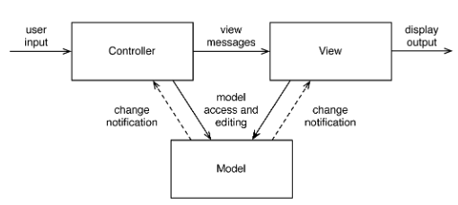

### Model View Control (MVC) Pattern _(Walchetseder)_
**Datei** Mvc.md  

Beschreiben Sie das Muster nach den folgenden Punkten:

- **Klassifikation** Gehört in die _Kategorie Architektur-Pattern_.
- **Zweck** des Musters ist ein _flexibler Programmentwurf_, der eine spätere _Änderung_ oder _Erweiterung erleichtert_ und eine _Wiederverwendbarkeit der einzelnen Komponenten_ ermöglicht.

- **Entwurfsproblem und wie das Muster das Problem löst**  
Wenn man den Code, der die Benutzeroberfläche verwaltet direkt in die Geschäftslogik einer Anwendung einbettet erhält man Anwendungen, deren eigentliche Funktionalität eng mit der Präsentation der Daten verwoben ist. Das Erschwert die Unterstützung verschiedener Plattformen und verkompliziert die Geschäftslogik.  
Jede interaktive Anwendung besteht aus Eingaben, Daten und der Darstellung der Daten auf dem Bildschirm. Problematisch wäre es vor allem bei größeren Anwendungen diese drei Elemente in einer Klasse (Formular) zusammenzufassen. MVC ist deswegen in drei Komponenten geteilt: *Model, View und Controller*.
  - **Model**  ist dafür verantwortlich, die Geschäftsprozesse und Domänenobjekte abzubilden, und es verarbeitet die Daten entsprechend den geschäftsspezifischen Anforderungen. Das Modell hängt nicht von spezifischen Ein-Ausgabeverhalten oder Benutzeroberflächen ab. Das Objektmodell enthält keinerlei Informationen über die Benutzeroberfläche.
  - **View**-Komponenten sind für die graphische Darstellung der Daten verantwortlich. Sie erhalten die anzuzeigenden Daten vom Modell. Mehrere Views können die gleichen Daten des Modells darstellen. Jede View hat einen oder mehrere Controller, die Eingaben vom Benutzer bekommen. Diese Eingaben werden in Events für die View oder das Modell umgewandelt. Jegliche Benutzerinteraktion wird durch Controller geregelt.
  - **Controller** sind verantwortlich für die Steuerung der Anwendung durch den Benutzer. Sie überwachen alle Eingabegeräte, werten die Eingabedaten aus und leiten sie weiter. Änderungen der Modelldaten werden also vom Controller eingeleitet. View und Controller bilden zusammen die Benutzungsoberfläche.
- **Anwendbarkeit**  
    Allgemein: größere  Softwareprojekte, GUI-Programmierung, Web-Anwendungen.  
  Das MVC-Paradigma ermöglicht ein flexibles Programmdesign, welches die Wiederverwendbarkeit der einzelnen MVC-Module und komplexer MVC-Komponenten sowie eine daraus resultierende reduzierte Gesamtkomplexität gewährleistet, insbesondere bei großen Anwendungen. 
   > _**Vorteile:**_  
    > -Die Anwendungslogik ist von den dazugehörenden Darstellungen und den Benutzerinteraktionen klar getrennt.  
-Ein Modell kann durch viele Darstellungsmodule repräsentiert werden.  
-Bestehende Systeme können einfach erweitert werden, indem neue Module und MVC-Komponenten hinzugefügt werden.  
-Trennung von Logik, Datenquelle und Visualisierung  
-logisch, unabhängige Klassen  
-ermöglicht agile Entwicklung  
-gezielter Einsatz von Experten für Design, Datenbank und Softwarearchitektur  
_**Nachteil:**_  
-erhöhter Aufwand bei kleinen Applikationen  

- **Struktur des Musters**  
  
*Quellen (links):*  [hs-augsburg.de](https://glossar.hs-augsburg.de/Model-View-Controller-Paradigma) | 
[rheinwerk-verlag.de](http://openbook.rheinwerk-verlag.de/oop/oop_kapitel_08_002.htm) | 
[inztitut.de](http://www.inztitut.de/blog/glossar/model-view-controller/)   
