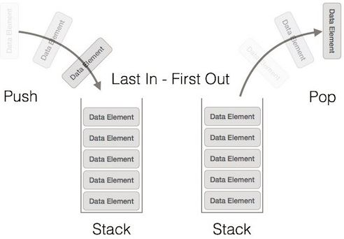
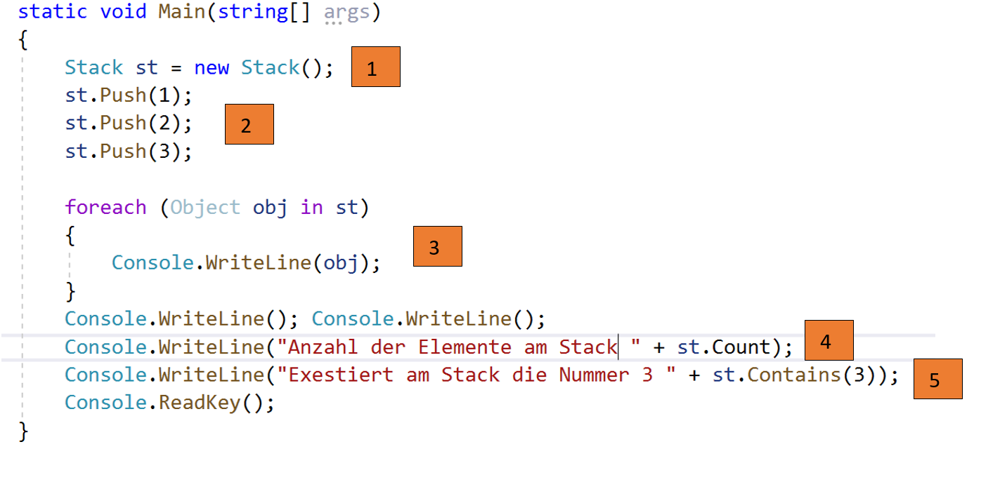
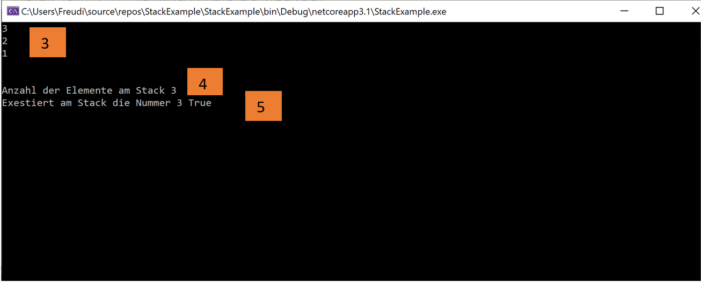
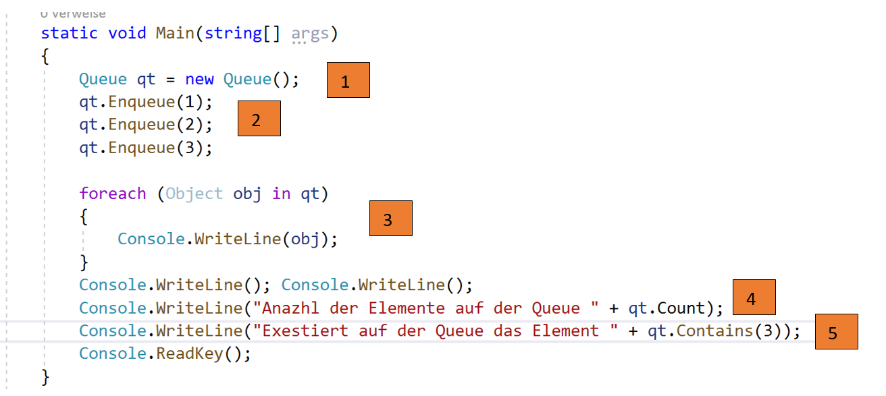
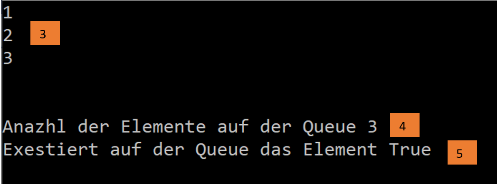
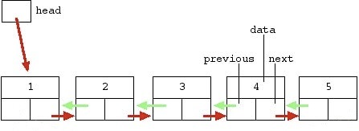
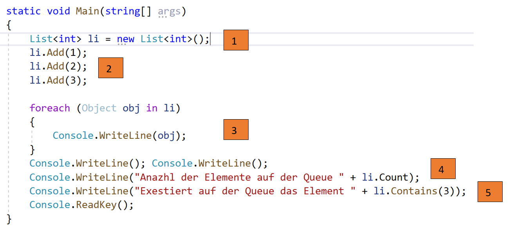
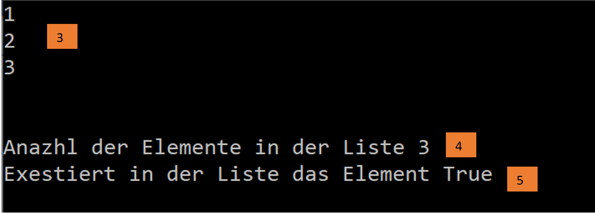
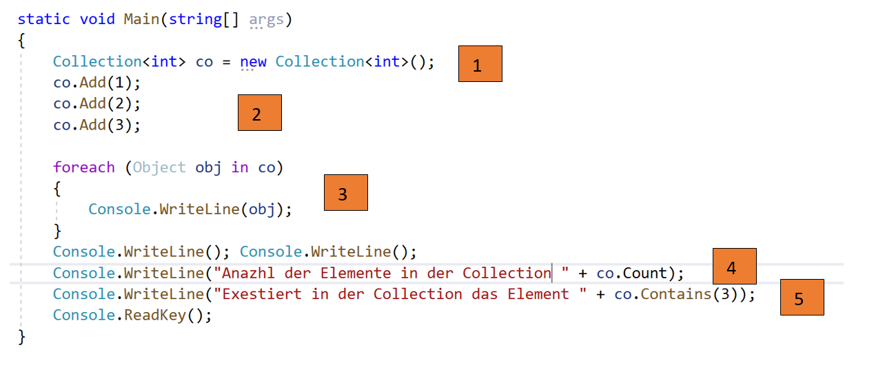
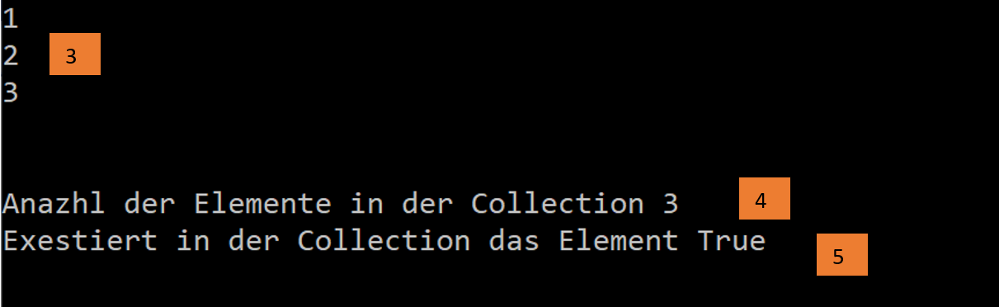

### Erklären Sie die folgenden abstrakten Datenstrukturen:
#### - Stack:
   

  - Ein Stack funktioniert in C# nach den last in first out (LIFO) Prinzip.
  - Deklaration eines Stacks: Stack st = new Stack()
  - Hinzufügen eines Elements zu dem Stack: Stack.push(element)
  - Element vom Stack herunternehmen: Stack.pop()
  - Anzahl von Elementen auf einem Stack: Stack.Count
  - Überprüfen ob sich ein Element auf dem Stack befindet: Stack.Contains(element)
  - Löschen eines gesammten Stacks mit Stack.Clear()
 ##### Beispiel:
   
    1: Stack wird definiert  
    2: Elemente werden auf Stack zugewiesen     
    3: Ausgabe sämmtlicher Elemente auf dem Stack   
    4: Anazhl der Elemente auf dem Stack    
    5: Element am Stack enthalten
 ##### Ausgabe:
   

  
#### - Queue:    
   

 - Implementiert eine spezielle Collection, welche nach den first in first out Prinzip arbeitet.
 - Praktisches Beispiel hierführ ist zb.: die Person die sich zuerst anstellt betritt zuerst den Bus.
 - Deklaration einer Queue: Queue qt = new Queue()
 - Hinzufügen eines Elements zu der Queue: Queue.enqueue(element)
 - Element von der Queue herunternehemen: Queue.dequeue()
 - Anazhl von Elementen auf einer Queue: Queue.Count
 - Überprüfen ob sich ein Element auf der Queue befindet: Queue.Contains(element)
 - Löschen der gesammten Queue: Queue.Clear()
##### Beispiel:
   
    1: Queue wird definiert  
    2: Elemente werden auf die Queue zugewiesen     
    3: Ausgabe sämmtlicher Elemente die sich auf der Queue befinden 
    4: Anazhl der Elemente auf der Queue    
    5: Element auf der Queue enthalten
##### Ausgabe
   

#### - Liste
   
  
 - Die Liste ist ein Objekt welches mehrere Variablen in einer definierten Reihenfolge hält.
 - Deklaration einer Liste: List<int> li = new List<int>();
 - Hinzufügen eines Elements zu der Liste: List.Add(element)
 - Element von der Liste entfernen: List.Remove(element)
 - Anazhl der Elemente in einer Liste: List.Count
 - Überprüfen ob sich ein Element in der Liste befindet: List.Contains(element)
 - Löschen der gesammten Liste: List.Clear()
##### Beispiel:
   
    1: List wird definiert  
    2: Elemente werden in die Liste hinzugefügt     
    3: Ausgabe sämmtlicher Elemente die sich in der Liste befinden 
    4: Anazhl der Elemente in der Liste    
    5: Element in der Liste enthalten
##### Ausgabe:
   

#### - Collection
   
 - Collections sind sehr ähnlich zu Arrays allerdings ermöglichen Collections eine flexiblere Arbeitsweise
 - Bei einem Array muss man die göße eines Arrays definieren. Bei einer Collection nicht
 - In C# gibt es mehrere Arten von Collections
     - Stack
     - List
     - Queue
 - Deklaration einer Collection: Collection<int> co = new Collection<int>();
 - Hinzufügen eines Elements zu einer Collection: Collection.Add(element)
 - Element von einer Collection entfernen: Collection.Remove(element)
 - Anazhl der Elemente in einer Collection: Collection.Count
 - Überprüfen ob siche ein Element in einer Collection befindet: Collection.Conatins(element)
 - Löschen der gesammten Collection: Collection.Clear()
##### Beispiel:
   
    1: Collection wird definiert  
    2: Elemente werden in die Collection hinzugefügt     
    3: Ausgabe sämmtlicher Elemente die sich in der Collection befinden 
    4: Anazhl der Elemente in der Collection    
    5: Element in der Collection enthalten
##### Ausgabe:
   

