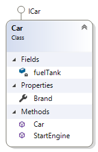
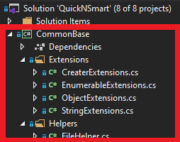
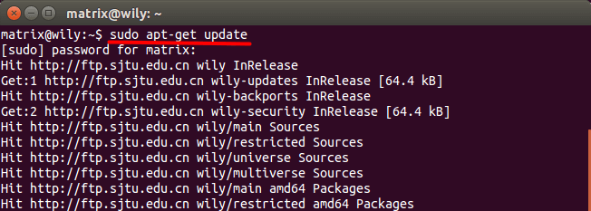

## Terms
### Ordnen Sie die nachfolgenden Begriffe nach ihrer Entstehung und erläutern Sie die Bedeutung:
**Verantwortlicher:** Engleder Michael

- Bibliothek
- Unterprogramm
- Prozedur
- Klasse
- Funktion
- Package
- Modul

-------------------------------------
#### Anfänge der Programmierung
Am Anfang wurde sämtlicher **Code in einem File** (Anmerkung: "Spaghetti-Code") geschrieben.  
In Skript-Sprachen wie CMD, PowerShell findet man oft heute noch diesen Ansatz vor!   

#### Unterprogramme
Unterprogramme oder in C# Methoden sind **Codeblöcke mit Anweisungen**.  
Ein Programm ruft ein Unterprogramme auf und alle Anweisungen innerhalb dieses Codeblocks werden ausgeführt!   
Diesen Ansatz nennt man **prozedurale Programmierung** und ebnete den Weg weg von Assemblersprachen hin zu höheren Sprachen.
Dabei können Unterprogramme sowohl Werte zurückgeben, oder Werte als Parameter vom Aufrufer erhalten.
Weiter können Methoden mit unterschiedlichen Zugriffsmodifikatoren (**private/public**) versehen werden.  
Siehe **Prozedur / Funktion**

#### Prozedur
Prozeduren sind Unterprogramme und werden von einem Programm aufgerufen, geben aber **keinen Wert (void)** zurück  
````
    class Program
    {
        static void Main(string[] args)
        {
            WriteHelloWorld
        }
        public static void WriteHelloWorld()
        {
            Console.WriteLine("Hello World!");
        }
    }
````

#### Funktion
Funktionen sind Unterprogramme, werden von einem Programm aufgerufen und geben **einen Wert** zurück.  
````
    class Program
    {
        static void Main(string[] args)
        {
            int sum = Sum(1, 2);
        }

        private static int Sum(int num1, int num2)
        {
            return num1 + num2;
        }
    }
````
#### Modul
Unterprogramme werden in **einer logischen Einheiten** (z.B in einer Datei) zusammengefasst!  
Die Unterprogramme eines Moduls können dann von einem Program aufgerufen werden.  
Module können einzeln geplant, programmiert und getestet werden.  
Hier verfolgt man die **modulare Programmierweise** mit **austauschbaren Komponenten** und **Datenkapselung**.
Zusätzlich wird durch die Aufteilung auch die Lesbarkeit des Codes verbessert.  

#### Klassen
Klassen beschreiben **Eigenschaften und Fähigkeiten** von Objekten. (= objektorientierte Programmierung)   
Klassen werden in C# mit **class** deklariert und können mit unterschiedlichen Zugriffsmodifikatoren (**private/public**) versehen werden.   
Diese können Fields, Properties und Methoden als sogenannte **Members** beinhalten.  
Klassen können von anderen Klassen oder Interfaces deren Members erben. (**Vererbung**)  
Instanziert werden Klassen in C# mit dem Schlüsselwort new(). Dabei wird der Konstruktor aufgerufen, welchen auch Parameter zur Instanzierung übergeben werden können.  

````
    public class Car: ICar
    {
        private int fuelTank;
        public string Brand { get; set; }
        public Car(int maxFuelLevel)
        {
            this.fuelTank = maxFuelLevel;
        }
        public void StartEngine()
        {
            // do someting
        }
    }
````
Abbildung Klassendiagramm  


#### Bibliothek
Bibliotheken sind **Sammlungen von Modulen und Klassen** und deren Unterprogramme.  
Diese können von einem Programmen angefordert werden.  
Im Unterschied zu Programmen stellen Bibliotheken **keine eigenen lauffähigen Einheiten** dar!  
**Datenkapselung** und Zugriffsmodifikatoren für den Aufruf spielen hier eine große Rolle.  
Nach der Kompilierung werden Bibliotheken unter .net in DLL-Dateien (Assembly) übersetzt!  
Bibliotheken können typischerweise in mehreren Software-Projekten eingesetzt werden...  
Abbildung Klassendiagramm  
  

#### Package
Ein Package kann neben dem eigentlichen ausführbaren Programm auch andere Programme und Dateien enthalten.  
Packages können z.B. einfache **Archive** (z.B. TAR-Packages unter Linux) darstellen und diese werden dann von einem Package-Manager angefordert. 

````
sudo apt-get update
# Aktualisiert die Package Datenbank unter der jeweiligen Linux Distribution
```` 
Abbildung PackageManager Linux  

